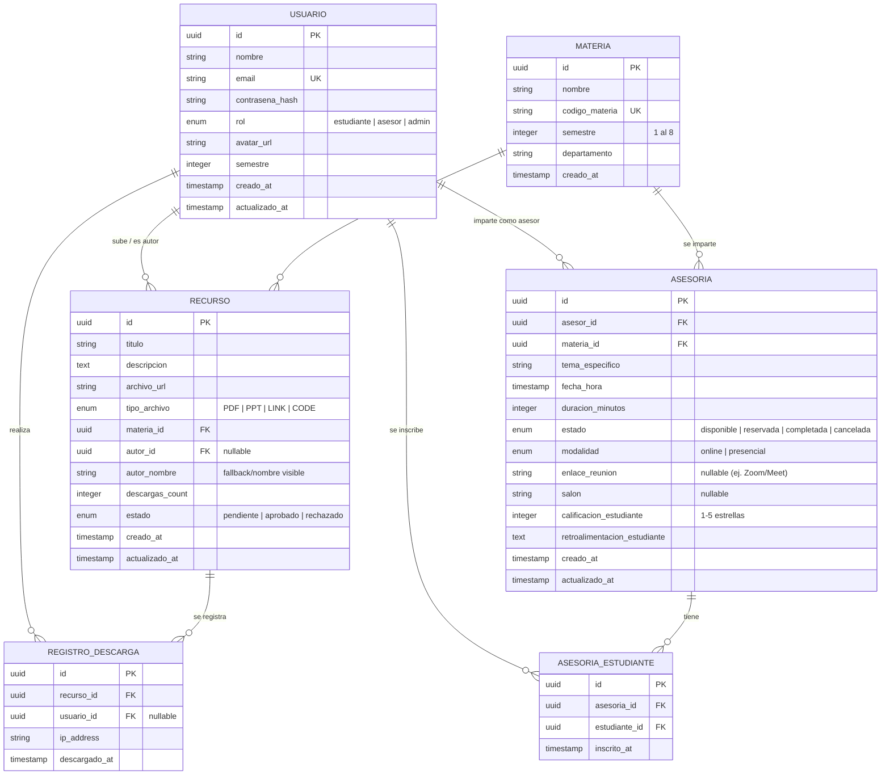

# Modelo de Entidades del Dominio (Base de Datos y APIs)

Este documento describe la arquitectura de datos, relaciones, reglas de negocio y estructuras de API requeridas para transformar el cascarón de interfaz de usuario del portal de **Recursos Académicos y Asesorías** en una aplicación web interactiva con funcionalidad real de extremo a extremo.

---

## 1. Diagrama Entidad-Relación (ERD)

A continuación se muestra la estructura relacional que soporta la autenticación, los recursos de estudio y la agenda de asesorías entre pares.



---

## 2. Diccionario de Datos Detallado

### 2.1 Entidad `USUARIO`
Representa a toda persona registrada en la plataforma (estudiantes, asesores pares y administradores).

| Campo | Tipo | Restricciones | Descripción |
| :--- | :--- | :--- | :--- |
| `id` | UUID | Primary Key, Default UUIDv4 | Identificador único del usuario. |
| `nombre` | VARCHAR(150) | NOT NULL | Nombre completo. |
| `email` | VARCHAR(255) | UNIQUE, NOT NULL | Correo institucional (ej. `@comunidad.unam.mx`). |
| `contrasena_hash` | VARCHAR(255) | NOT NULL | Contraseña cifrada con algoritmo seguro (ej. bcrypt/argon2). |
| `rol` | ENUM | NOT NULL | Valores: `estudiante`, `asesor`, `admin`. |
| `avatar_url` | VARCHAR(512) | NULLABLE | URL de la foto de perfil en almacenamiento S3 o Cloudinary. |
| `semestre` | INTEGER | NULLABLE | Semestre activo en curso (1 al 8). |
| `creado_at` | TIMESTAMP | DEFAULT CURRENT_TIMESTAMP | Fecha de creación del perfil. |
| `actualizado_at` | TIMESTAMP | DEFAULT CURRENT_TIMESTAMP | Fecha de la última actualización. |

* **Regla de Negocio:** Solo los usuarios con rol `asesor` pueden registrar horarios para impartir asesorías. Los administradores controlan la aprobación de recursos pesados.

---

### 2.2 Entidad `MATERIA`
Catálogo estático o dinámico de asignaturas académicas por semestre.

| Campo | Tipo | Restricciones | Descripción |
| :--- | :--- | :--- | :--- |
| `id` | UUID | Primary Key, Default UUIDv4 | Identificador único de la asignatura. |
| `nombre` | VARCHAR(150) | NOT NULL | Nombre oficial (ej. *Cálculo Diferencial e Integral I*). |
| `codigo_materia` | VARCHAR(20) | UNIQUE, NOT NULL | Código administrativo de la UNAM/facultad (ej. *1101*). |
| `semestre` | INTEGER | NOT NULL, CHECK (1..8) | Semestre sugerido del plan de estudios. |
| `departamento` | VARCHAR(100) | NULLABLE | Área a la que pertenece (ej. *Matemáticas*, *Computación*). |
| `creado_at` | TIMESTAMP | DEFAULT CURRENT_TIMESTAMP | Fecha de inserción. |

---

### 2.3 Entidad `RECURSO`
Material didáctico cargado por los usuarios para consulta y descarga pública.

| Campo | Tipo | Restricciones | Descripción |
| :--- | :--- | :--- | :--- |
| `id` | UUID | Primary Key, Default UUIDv4 | Identificador único del recurso académico. |
| `titulo` | VARCHAR(255) | NOT NULL | Nombre descriptivo del archivo (ej. *Formulario de Geometría Analítica*). |
| `descripcion` | TEXT | NULLABLE | Resumen de los temas cubiertos en el archivo. |
| `archivo_url` | VARCHAR(512) | NOT NULL | Enlace de descarga (S3, Drive, Github, etc.). |
| `tipo_archivo` | ENUM | NOT NULL | Valores permitidos: `PDF`, `PPT` (Presentaciones), `LINK` (Videos/Webs), `CODE` (Scripts). |
| `materia_id` | UUID | FOREIGN KEY, NOT NULL | Relación con la tabla `MATERIA`. |
| `autor_id` | UUID | FOREIGN KEY, NULLABLE | Relación con `USUARIO` que lo subió (nulo si es anónimo). |
| `autor_nombre` | VARCHAR(150) | NOT NULL | Nombre visible del creador para el público. |
| `descargas_count` | INTEGER | DEFAULT 0, >= 0 | Contador de descargas totales acumuladas. |
| `estado` | ENUM | NOT NULL, DEFAULT 'aprobado' | Valores: `pendiente`, `aprobado`, `rechazado` (moderación anti-spam). |
| `creado_at` | TIMESTAMP | DEFAULT CURRENT_TIMESTAMP | Fecha de subida. |
| `actualizado_at` | TIMESTAMP | DEFAULT CURRENT_TIMESTAMP | Última fecha de edición del recurso. |

---

### 2.4 Entidad `REGISTRO_DESCARGA`
Para analítica y control de duplicación maliciosa en los contadores de descargas.

| Campo | Tipo | Restricciones | Descripción |
| :--- | :--- | :--- | :--- |
| `id` | UUID | Primary Key, Default UUIDv4 | Identificador del registro. |
| `recurso_id` | UUID | FOREIGN KEY, NOT NULL | Recurso que fue descargado. |
| `usuario_id` | UUID | FOREIGN KEY, NULLABLE | Usuario autenticado que descargó (nulo si es anónimo). |
| `ip_address` | VARCHAR(45) | NOT NULL | Dirección IP del cliente (soporta IPv4 e IPv6). |
| `descargado_at` | TIMESTAMP | DEFAULT CURRENT_TIMESTAMP | Marca temporal de la descarga. |

---

### 2.5 Entidad `ASESORIA`
Gestiona el agendamiento e impartición de asesorías académicas personalizadas.

| Campo | Tipo | Restricciones | Descripción |
| :--- | :--- | :--- | :--- |
| `id` | UUID | Primary Key, Default UUIDv4 | Identificador de la sesión de asesoría. |
| `asesor_id` | UUID | FOREIGN KEY, NOT NULL | Usuario con rol `asesor` que impartirá la sesión. |
| `materia_id` | UUID | FOREIGN KEY, NOT NULL | Asignatura en la cual se apoya al estudiante. |
| `tema_especifico` | VARCHAR(255) | NOT NULL | Tema concreto solicitado (ej. *Inducción Matemática*, *Punteros en C*). |
| `fecha_hora` | TIMESTAMP | NOT NULL | Fecha y hora exacta de inicio de la sesión. |
| `duracion_minutos` | INTEGER | DEFAULT 60, > 0 | Duración aproximada (habitualmente 60 o 90 mins). |
| `estado` | ENUM | NOT NULL, DEFAULT 'disponible' | Estados: `disponible`, `reservada`, `completada`, `cancelada`. |
| `modalidad` | ENUM | NOT NULL | Opciones: `online` (videoconferencia) o `presencial`. |
| `enlace_reunion` | VARCHAR(512) | NULLABLE | Link generado automáticamente (Zoom, Google Meet, Teams). |
| `salon` | VARCHAR(100) | NULLABLE | Aula o punto de encuentro físico si es presencial (ej. *Cubiculo 5 de Biblioteca*). |
| `calificacion_estudiante` | INTEGER | NULLABLE, CHECK (1..5) | Evaluación del estudiante hacia el asesor al finalizar. |
| `retroalimentacion_estudiante`| TEXT | NULLABLE | Comentarios complementarios sobre la utilidad de la sesión. |
| `creado_at` | TIMESTAMP | DEFAULT CURRENT_TIMESTAMP | Fecha de registro de disponibilidad. |
| `actualizado_at` | TIMESTAMP | DEFAULT CURRENT_TIMESTAMP | Última edición de estado o detalles. |

---

### 2.6 Entidad `ASESORIA_ESTUDIANTE`
Tabla intermedia que gestiona la inscripción de uno o varios estudiantes a una sesión de asesoría (relación muchos a muchos).

| Campo | Tipo | Restricciones | Descripción |
| :--- | :--- | :--- | :--- |
| `id` | UUID | Primary Key, Default UUIDv4 | Identificador único del registro de inscripción. |
| `asesoria_id` | UUID | FOREIGN KEY, NOT NULL | Relación con la tabla `ASESORIA`. |
| `estudiante_id` | UUID | FOREIGN KEY, NOT NULL | Relación con la tabla `USUARIO` que representa al estudiante inscrito. |
| `inscrito_at` | TIMESTAMP | DEFAULT CURRENT_TIMESTAMP | Fecha de registro de la inscripción del estudiante a la asesoría. |

---

## 3. Índices de Base de Datos Recomendados (Optimización de Rendimiento)

Para acelerar las búsquedas concurrentes y filtros que maneja el frontend, se deben configurar los siguientes índices en la base de datos:

1. **`idx_recurso_busqueda`** en `RECURSO (materia_id, tipo_archivo, estado)`  
   *Acelera los filtros laterales y dropdowns de "Tipo de recurso" y materias por semestre en tiempo real.*
2. **`idx_asesoria_agenda`** en `ASESORIA (asesor_id, fecha_hora, estado)`  
   *Evita el solapamiento de horarios del asesor y optimiza las agendas de estudiantes.*
3. **`idx_materia_semestre`** en `MATERIA (semestre)`  
   *Para filtrar de inmediato las asignaturas en la vista "Ver materias del Semestre X".*
4. **`idx_descargas_analitica`** en `REGISTRO_DESCARGA (recurso_id, descargado_at)`  
   *Permite desplegar estadísticas rápidas y clasificar los recursos más populares del mes.*

---

## 4. Endpoints y Payloads de API (Estructuras JSON Clave)

### 4.1 Subida de un Nuevo Recurso (`POST /api/resources`)
Enviado cuando el usuario interactúa con la sección de formulario `"Comparte tu conocimiento"`.

**Cuerpo de la Petición (Request Body):**
```json
{
  "titulo": "Formulario Completo de Geometría Analítica",
  "descripcion": "Contiene fórmulas de la recta, circunferencia, parábola, elipse e hipérbola con esquemas gráficos explicativos.",
  "tipo_archivo": "PDF",
  "archivo_url": "https://storage.asesoriasunam.edu/uploads/recurso_486820293.pdf",
  "materia_id": "c309e4a8-6f68-450f-90db-2b5a1df93c5d",
  "autor_nombre": "Carlos Alberto Mendoza"
}
```

**Respuesta Exitosa (201 Created):**
```json
{
  "id": "76fae101-3829-4d2a-89ea-76c245c38711",
  "titulo": "Formulario Completo de Geometría Analítica",
  "archivo_url": "https://storage.asesoriasunam.edu/uploads/recurso_486820293.pdf",
  "tipo_archivo": "PDF",
  "materia": {
    "id": "c309e4a8-6f68-450f-90db-2b5a1df93c5d",
    "nombre": "Geometría Analítica I",
    "semestre": 1
  },
  "autor_nombre": "Carlos Alberto Mendoza",
  "descargas_count": 0,
  "estado": "aprobado",
  "creado_at": "2026-05-21T03:18:25Z"
}
```

---

### 4.2 Reservar una Asesoría (`PATCH /api/appointments/{id}/book`)
Ejecutado cuando un estudiante hace clic en agendar sobre el bloque de disponibilidad horaria de un asesor.

**Cuerpo de la Petición (Request Body):**
```json
{
  "estudiante_id": "e44d320b-22fa-48ef-be64-81d2df0f0322",
  "tema_especifico": "Dudas en la demostración de la ecuación general de la parábola.",
  "modalidad": "online"
}
```

**Respuesta Exitosa (200 OK):**
```json
{
  "id": "01bcf5a8-48c2-4933-8fe2-8141444b029a",
  "estado": "reservada",
  "tema_especifico": "Dudas en la demostración de la ecuación general de la parábola.",
  "fecha_hora": "2026-05-25T14:00:00-06:00",
  "duracion_minutos": 60,
  "modalidad": "online",
  "enlace_reunion": "https://meet.google.com/abc-defg-hij",
  "asesor": {
    "id": "992a01fb-2234-4b53-b992-0b2a7593c21a",
    "nombre": "Ana Sofía García"
  },
  "estudiantes": [
    {
      "id": "e44d320b-22fa-48ef-be64-81d2df0f0322",
      "nombre": "Juan Pérez Soler",
      "inscrito_at": "2026-05-21T07:45:00Z"
    }
  ]
}
```

---

### 4.3 Listar Recursos con Filtros Dinámicos (`GET /api/resources?materiaId=&tipo=&semestre=`)
El backend procesa los parámetros query para alimentar la pantalla de **Recursos Recientes**.

**Ejemplo de Llamada:**
`GET /api/resources?semestre=1&tipo=PDF`

**Respuesta Exitosa (200 OK):**
```json
{
  "total": 3,
  "page": 1,
  "data": [
    {
      "id": "3bb8e8c1-11d2-430c-ab22-0cc696c214bb",
      "titulo": "Apuntes Completos de Cálculo Diferencial",
      "tipo": "PDF",
      "semestre": "Semestre 1",
      "materia": "Cálculo Diferencial e Integral I",
      "autor": "Juan Pérez",
      "descargas": 234
    },
    {
      "id": "c1f7b9c9-9402-4212-be22-482a0ccfb2cc",
      "titulo": "Ejercicios Resueltos de Álgebra Superior",
      "tipo": "PDF",
      "semestre": "Semestre 1",
      "materia": "Álgebra Superior I",
      "autor": "Carlos Mendoza",
      "descargas": 312
    },
    {
      "id": "f2ccba10-a10c-40cc-87cf-49b01cff2c10",
      "titulo": "Formulario de Geometría Analítica",
      "tipo": "PDF",
      "semestre": "Semestre 1",
      "materia": "Geometría Analítica I",
      "autor": "Luis Torres",
      "descargas": 278
    }
  ]
}
```

---

## 5. Reglas Críticas de Integridad y Validación

1. **Evitar Solapamientos Horarios:**  
   Un asesor no puede registrar un bloque de disponibilidad (`ASESORIA`) que se cruce en fecha/hora y duración con otra asesoría ya activa o planificada para sí mismo.
2. **Validación de Correo Universitario:**  
   El campo `Usuario.email` debe someterse a una validación mediante expresión regular para asegurar que pertenezca a los dominios universitarios válidos de la institución académica para evitar intrusos ajenos al alumnado.
3. **Control de Descarga Única:**  
   Al incrementar `descargas_count` de la tabla `RECURSO`, el servidor debe comprobar que no existan más de 3 descargas repetidas para la misma combinación de `recurso_id` + `ip_address` dentro de un periodo de 5 minutos, con el fin de evitar ataques de bots inflando estadísticas.
4. **Borrado en Cascada y Restricciones:**  
   Si se elimina una `MATERIA`, no se debe permitir la eliminación física si existen `RECURSO` o `ASESORIA` asociados a ella (`RESTRICT`), garantizando la preservación del archivo histórico.
